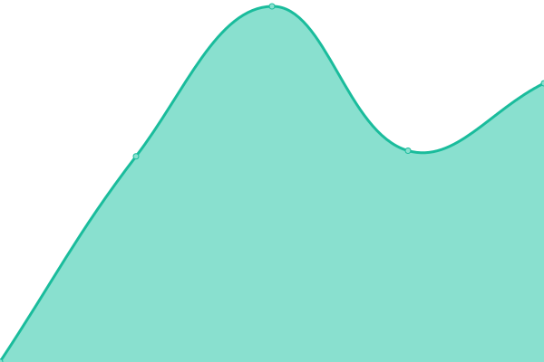
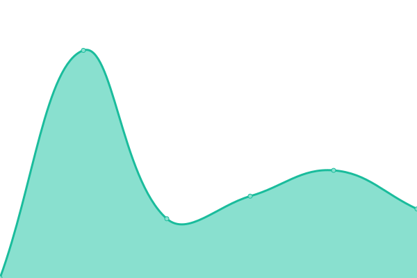

# [📈 Live Status](https://upptime.lynx3.top): <!--live status--> **🟧 Partial outage**

This repository contains the open-source uptime monitor and status page for [ad3wc659b4e4f](https://upptime.lynx3.top), powered by [Upptime](https://github.com/upptime/upptime).

With [Upptime](https://upptime.js.org), you can get your own unlimited and free uptime monitor and status page, powered entirely by a GitHub repository. We use [Issues](https://github.com/ad3wc659b4e4f/upptime/issues) as incident reports, [Actions](https://github.com/ad3wc659b4e4f/upptime/actions) as uptime monitors, and [Pages](https://upptime.lynx3.top) for the status page.

<!--start: status pages-->
<!-- This summary is generated by Upptime (https://github.com/upptime/upptime) -->
<!-- Do not edit this manually, your changes will be overwritten -->
<!-- prettier-ignore -->
| URL | Status | History | Response Time | Uptime |
| --- | ------ | ------- | ------------- | ------ |
|  [Vercel](https://www.lynx3.cc/) | 🟩 Up | [vercel.yml](https://github.com/ad3wc659b4e4f/upptime/commits/HEAD/history/vercel.yml) | 

 1030ms
     
 | 

<a href="https://upptime.lynx3.cc/history/vercel">100.00%</a>
    

|  [Netlify](https://nl2.lynx3.cc/) | 🟩 Up | [netlify.yml](https://github.com/ad3wc659b4e4f/upptime/commits/HEAD/history/netlify.yml) | 

 1334ms
     
 | 

<a href="https://upptime.lynx3.cc/history/netlify">99.73%</a>
    

|  [GitHub Pages](https://gh.lynx3.cc/) | 🟩 Up | [git-hub-pages.yml](https://github.com/ad3wc659b4e4f/upptime/commits/HEAD/history/git-hub-pages.yml) | 

 147ms
     
 | 

<a href="https://upptime.lynx3.cc/history/git-hub-pages">99.73%</a>
    

|  [Twikoo Vercel](https://vc.tk.api.lynx3.cc/) | 🟩 Up | [twikoo-vercel.yml](https://github.com/ad3wc659b4e4f/upptime/commits/HEAD/history/twikoo-vercel.yml) | 

 5966ms
     
 | 

<a href="https://upptime.lynx3.cc/history/twikoo-vercel">99.73%</a>
    

|  [Twikoo Netlify](https://nl.tk.api.lynx3.cc/.netlify/functions/twikoo) | 🟩 Up | [twikoo-netlify.yml](https://github.com/ad3wc659b4e4f/upptime/commits/HEAD/history/twikoo-netlify.yml) | 

 3185ms
     
 | 

<a href="https://upptime.lynx3.cc/history/twikoo-netlify">99.73%</a>
    

|  [Waline Vercel](https://vc.wl.api.lynx3.cc/) | 🟩 Up | [waline-vercel.yml](https://github.com/ad3wc659b4e4f/upptime/commits/HEAD/history/waline-vercel.yml) | 

 3755ms
     
 | 

<a href="https://upptime.lynx3.cc/history/waline-vercel">99.73%</a>
    

|  [Vercount Vercel](https://vercount.api.lynx3.cc/js) | 🟥 Down | [vercount-vercel.yml](https://github.com/ad3wc659b4e4f/upptime/commits/HEAD/history/vercount-vercel.yml) | 

 0ms
     
 | 

<a href="https://upptime.lynx3.cc/history/vercount-vercel">99.73%</a>
    

<!--end: status pages-->

[**Visit our status website →**](https://upptime.lynx3.top)

## 📄 License

- Powered by: [Upptime](https://github.com/upptime/upptime)
- Code: [MIT](./LICENSE) © [Anand Chowdhary](https://anandchowdhary.com), supported by [Pabio](https://pabio.com)
- Data in the `./history` directory: [Open Database License](https://opendatacommons.org/licenses/odbl/1-0/)
